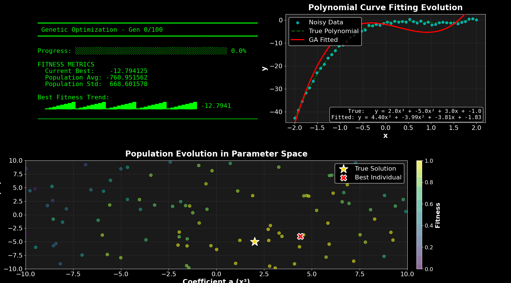

# genetic_engine

A Python library for genetic algorithm optimisation — from one-liner convenience functions to fully configurable evolutionary search.



## Quick Start

```bash
pip install -e .
```

```python
from genetic_opt import minimize

result = minimize(
    lambda x: sum(xi ** 2 for xi in x),
    bounds=[(-5, 5)] * 10,
)
print(result.x, result.fun)
```

```python
from genetic_opt import maximize

result = maximize(
    lambda x: -(x[0] - 3) ** 2 - (x[1] + 1) ** 2,
    bounds=[(-10, 10)] * 2,
)
```

## Features

### Optimisation
- **Minimize and maximize** — `sense="minimize"` or `sense="maximize"`
- **Early stopping** — stop when fitness plateaus (`convergence_threshold`)
- **Constraint handling** — penalty-based inequality constraints
- **Population seeding** — inject known-good solutions
- **Callbacks** — per-generation hooks for custom logging or stopping

### Operators
- **Crossover** — `single_point`, `uniform`, `blx_alpha`, `sbx` (Simulated Binary)
- **Selection** — `tournament`, `roulette`, `rank`
- **Mutation** — Gaussian perturbation with configurable scale
- **Adaptive mutation** — auto-adjusts rate based on population diversity

### Analysis
- **Live terminal monitor** — curses-based real-time display
- **Visualisation suite** — fitness landscapes, population density, 3D migration, PCA/t-SNE, correlation heatmaps, animated MP4/GIF
- **Data export** — CSV metrics, population history, JSON metadata

### Benchmarks
Built-in test functions: Sphere, Rastrigin, Rosenbrock, Ackley, Griewank, Schwefel.

## Examples & Tutorials

Run `python scripts/run_examples.py` for the full menu, or start with the tutorial:

```bash
python -m genetic_opt.sga.examples.quickstart
```

| Example | Description | Command |
|---------|-------------|---------|
| **Quick-start tutorial** | 10-section walkthrough of every feature | `python -m genetic_opt.sga.examples.quickstart` |
| **Polynomial fitting** | Fit a curve to noisy data with live visualisation | `python scripts/run_polynomial_example.py` |
| **Engineering design** | Pressure vessel cost minimisation with 4 constraints | `python -m genetic_opt.sga.examples.engineering_design` |
| **PID controller tuning** | Tune Kp/Ki/Kd for a simulated plant | `python -m genetic_opt.sga.examples.parameter_tuning` |
| **Constrained optimisation** | Himmelblau's function with inequality constraints | `python -m genetic_opt.sga.examples.constrained_optimization` |
| **Multi-start** | Multiple restarts vs. single run on Rastrigin | `python -m genetic_opt.sga.examples.multi_start` |
| **Benchmark suite** | Run all test functions, compare in a table | `python -m genetic_opt.sga.examples.benchmark_suite` |
| **Operator comparison** | Grid search: crossover x selection on 4 problems | `python -m genetic_opt.sga.examples.operator_comparison` |
| **High-dimensional** | 20D comparison of operator configurations | `python -m genetic_opt.sga.examples.high_dimensional` |

## API Reference

### Convenience Functions

```python
from genetic_opt import minimize, maximize

# Minimise with defaults (population scales with dimensionality)
result = minimize(func, bounds)

# Full control
result = minimize(
    func,
    bounds=[(-5, 5)] * 10,
    n_generations=500,
    population_size=200,
    crossover_type="sbx",
    selection_type="rank",
    adaptive_mutation=True,
    convergence_threshold=1e-6,
    constraints=[lambda x: x[0] - 1],   # x[0] <= 1
    seed_population=[[0.1] * 10],
)

print(result.x)              # Best solution
print(result.fun)            # Best fitness value
print(result.n_generations)  # Generations actually run
print(result.converged)      # Whether early stopping triggered
print(result.metrics)        # Full metrics history
```

### Class API

```python
from genetic_opt import SimpleGeneticAlgorithm

ga = SimpleGeneticAlgorithm(
    fitness_function=my_func,
    population_size=200,
    sense="minimize",
    mutation_rate=0.15,
    crossover_type="sbx",
    selection_type="tournament",
    tournament_size=5,
    elite_size=20,
    adaptive_mutation=True,
    verbose=True,
)

best_x, best_f = ga.optimize(
    n_generations=300,
    chromosome_length=10,
    bounds=[(-5, 5)] * 10,
)
```

### Benchmarks

```python
from genetic_opt import get_benchmark, BENCHMARKS

print(list(BENCHMARKS.keys()))
# ['sphere', 'rastrigin', 'rosenbrock', 'ackley', 'griewank', 'schwefel']

bench = get_benchmark("rastrigin", ndim=10)
# bench["func"], bench["bounds"], bench["optimum"]
```

## Project Structure

```
genetic_opt/
  __init__.py              # Top-level exports: minimize, maximize, etc.
  sga/
    optimizer.py           # GeneticOptimizer ABC + SimpleGeneticAlgorithm
    operators.py           # Crossover and selection operator functions
    api.py                 # minimize() / maximize() convenience API
    benchmarks.py          # Standard test functions (Sphere, Rastrigin, ...)
    examples/
      quickstart.py        # Progressive tutorial
      polynomial_fit.py    # Curve fitting with visualisation
      engineering_design.py    # Pressure vessel design
      parameter_tuning.py      # PID controller tuning
      constrained_optimization.py
      multi_start.py
      benchmark_suite.py
      operator_comparison.py
      high_dimensional.py
    utils/
      monitor.py           # Live terminal monitor (curses)
      export.py            # CSV/JSON export
      visualization.py     # Matplotlib plots and animations
scripts/                   # Runner scripts
tests/                     # pytest test suite (35 tests)
```

## Testing

```bash
pip install -e ".[dev]"
python -m pytest tests/ -v
```

## License

[MIT License](LICENSE)
